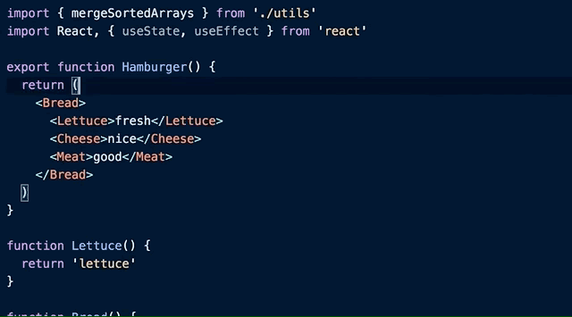

As a keyboard guy, I'd like to leverage all kinds of shortcuts as much as I can. It is especially true when it comes to coding. VS Code has been my favorite code editor for years, and I really love the way it allows me to use and customize shortcuts. Today I picked my top 10 badass yet less known ones. Check it out!

### 1. Go to last edit location `⌘K ⌘Q`

Sometimes when I write the code, I need to pause a bit and go to other places in the same file, or even other files to check other things. And after that, I need to quickly go back to the place where I was editing. This shortcut makes the move so easy.


### 2. Go to bracket `⌘ ⇧ \`

Say I am at the beginning of a relatively long function or `ifelse` block, and I want to quickly go to the end of the block to add some new code, I use this shortcut so I don't have to scroll down and visually find the matching bracket.


### 3. Select to bracket

No default shortcut. I use `⌥ \`

Also related to brackets, this one allows me to quickly select everything between brackets. It is super handy when you want to move some code out of a block.


VS Code doesn't have a default keybinding for this, so to enable it, you need to type `⌘ ⇧ P` to open command palette and go to `Open keyboard shortcuts (JSON)`, and paste the code below.

```json
{
  "key": "alt+\\",
  "command": "editor.action.selectToBracket",
  "args": { "selectBrackets": false }
}
```

### 4. Go to matching pair

No default shortcut. I use `⌘ H`

Similar to go to bracket, this one allows you to quickly go to the matching tag. I really love this when I am writing React components, as I can easily find the opening or closing tag and add new code from there.


Again, this one doesn't have a default shortcut. You can add the code below to enable it.

```json
{
  "key": "cmd+h",
  "command": "editor.emmet.action.matchTag"
}
```

### 5. Go to the previous file `⌘ P P`

I use this shortcut A LOT. Sometimes I just walk through some files without really editing them, and if I want to go back to the previous file, I cannot really use `go back` or `go to the last edit location` as both are cursor-based. So in that case, I hold `⌘` and press `P` twice and release `⌘`, it will bring me to the previous file.


### 6. Go to symbol in editor `⌘ ⇧ O`

Say I am looking at a file and I want to quickly go to a function, I can use this shortcut and type the keyword of the function, then hit enter to jump to it. This is quicker and more accurate than using `Find`.


### 7. Toggle column selection mode

No default shortcut. I use `⌘ ⇧ I`

This is super cool when you want to add code to several lines at once. Instead of using mouse and multi-selection, I use this shortcut to turn on the column selection mode and hold `⇧` and use arrow keys to select lines and start editing. After finish it, I type the shortcut again to turn off the column selection mode.


You can add the code below to enable it.

```json
{
  "key": "shift+cmd+i",
  "command": "editor.action.toggleColumnSelection"
}
```

### 8. Focus on Files Explorer

No default shortcut. I use `⌥ ⌘ J`

I use this shortcut to focus the current file in the explorer, so I can rename it or create a new file in the same folder. This is really handy as I don't need to search or manually find the file in the file tree.


You can add the code below to enable it.

```json
{
  "key": "alt+cmd+j",
  "command": "workbench.files.action.focusFilesExplorer"
}
```

### 9. Organize imports `⇧ ⌥ O`

Sometimes as I edit or refactor the code, I might have some unused imports at the beginning of the file. Instead of manually deleting them, I use this shortcut to do the job automatically. This one also re-orders the imports to make them look clean.



### 10. [Typescript] Add all missing imports `⌘ .`

This shortcut is actually for `quick fix`, and I found there is an option that allows you to add all the missing `import` statements, so you don't need to add them one by one. This option is available in typescript files.


That's it. I hope you enjoy this post.

Feel free to ask me any questions. You can also [find me on twitter](https://twitter.com/terrytyli).
